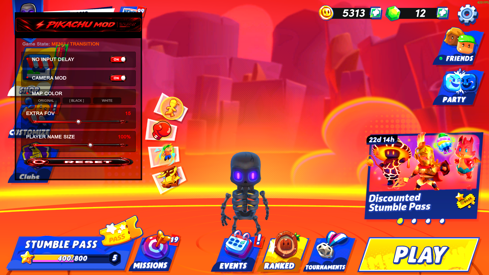

# PIKACHU MOD for Stumble Guys

A lightweight, client-side camera and latency utility for the Steam version of Stumble Guys.

> **Unofficial community project.** Not affiliated with, endorsed by, or supported by Scopely or Stumble Guys.

## Features

- In-game **PIKACHU MOD** control panel
- `F2` shows or hides the panel
- Low-latency toggle disables VSync and requests a 288 FPS cap
- Camera toggle, FOV slider, and reset button
- No changes to abilities, cooldowns, networking, or server logic

## Compatibility

- Stumble Guys `0.102` (Steam)
- Unity `6000.0.68f1`
- MelonLoader `0.7.3`
- Windows x64

Game updates may require a new build.

## Installation

1. Install [MelonLoader](https://github.com/LavaGang/MelonLoader) for `Stumble Guys.exe` with the x64 option.
2. Launch the game once, reach the main menu, and close it.
3. Download `StumbleCameraLatencyMod.dll` from the latest Release.
4. Copy it to `C:\Program Files (x86)\Steam\steamapps\common\Stumble Guys\Mods`.
5. Start the game and press `F2`.

## Controls

| Control | Action |
| --- | --- |
| `F2` | Show/hide PIKACHU MOD |
| Low Input Delay | Toggle latency-oriented frame settings |
| Camera Mod | Toggle custom FOV |
| Camera Distance | Adjust camera FOV |
| Reset Camera | Restore the original camera FOV |

## Notes

- “Low Input Delay” does not mean literal zero latency. Controller, frame, display, simulation, and network latency still apply.
- This camera control changes field of view; high values can distort the image.
- If the game does not start, remove the mod DLL and inspect `MelonLoader/Latest.log`.

## Building

Target .NET 6 x64. Copy the required DLLs from your local MelonLoader installation into a local `References` directory. Do not commit or redistribute game assemblies. Build `Release` in Visual Studio 2022.

## License

Source code is available under the [MIT License](LICENSE). Stumble Guys and related assets belong to their respective owners.
